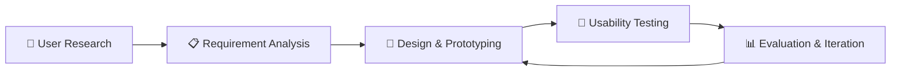

# 🎨 Usability Engineering

<div align="center">


**A comprehensive exploration of user-centered design principles, methods, and practical implementations**

[📖 Documentation](#-overview) • [🎯 Objectives](#-objectives) • [🛠 Tools](#-tools--technologies) • [📂 Assignments](#-repository-structure)

</div>

---

## 📑 Table of Contents

- [📌 Overview](#-overview)
- [🎯 Objectives](#-objectives)
- [🧩 Key Principles](#-key-principles)
- [🔄 Usability Engineering Process](#-usability-engineering-process)
- [🛠 Common Usability Methods](#-common-usability-methods)
- [📊 Usability Metrics](#-usability-metrics)
- [🌍 Applications](#-applications)
- [📚 Tools & Technologies](#-tools--technologies)
- [✅ Benefits](#-benefits-of-usability-engineering)
- [📂 Repository Structure](#-repository-structure)
- [🚀 Getting Started](#-getting-started)
- [🧑‍💻 Author](#-author)
- [📄 License](#-license)

---

## 📌 Overview

**Usability Engineering** is a user-centered approach to designing interactive systems that are **easy to learn**, **efficient to use**, and **satisfying** for users. It focuses on understanding user needs, tasks, and environments, and applying systematic methods to improve the overall **User Experience (UX)**.

This discipline is widely used in:
- 💻 Software Engineering
- 📱 Web & Mobile Application Development
- 🖥️ Human–Computer Interaction (HCI)
- 🎨 Product Design

---

## 🎯 Objectives

The main goals of Usability Engineering are:

| Objective | Description |
|-----------|-------------|
| 🎯 **Effectiveness & Efficiency** | Improve system performance and user productivity |
| ❌ **Error Reduction** | Reduce user errors and learning time |
| 😊 **User Satisfaction** | Increase overall user satisfaction |
| ♿ **Accessibility** | Ensure accessibility and inclusiveness |
| 🎪 **User-Centered** | Design systems that match real user needs |

---

## 🧩 Key Principles

```
┌─────────────────────────────────────────────────────────────┐
│  🎯 User-Centered Design (UCD)                              │
│     Design based on user needs and feedback                 │
├─────────────────────────────────────────────────────────────┤
│  🔄 Consistency                                              │
│     Similar actions should produce similar results          │
├─────────────────────────────────────────────────────���───────┤
│  ✨ Simplicity                                               │
│     Minimize complexity and cognitive load                  │
├─────────────────────────────────────────────────────────────┤
│  💬 Feedback                                                 │
│     Inform users about system status and actions            │
├─────────────────────────────────────────────────────────────┤
│  🛡️ Error Prevention & Recovery                             │
│     Prevent errors and help users recover easily            │
└─────────────────────────────────────────────────────────────┘
```

---

## 🔄 Usability Engineering Process



### Process Steps

1. **👥 User Research**
   - Identify users, goals, and context
   - Conduct user interviews and observations

2. **📋 Requirement Analysis**
   - Define usability requirements
   - Establish success criteria

3. **🎨 Design & Prototyping**
   - Create wireframes, mockups, and prototypes
   - Iterate based on feedback

4. **🧪 Usability Testing**
   - Test with real users
   - Gather qualitative and quantitative data

5. **📊 Evaluation & Iteration**
   - Analyze results and improve design
   - Refine based on insights

---

## 🛠 Common Usability Methods

| Method | Description | When to Use |
|--------|-------------|-------------|
| 🔍 **Heuristic Evaluation** | Expert review based on usability principles | Early design stages |
| 👥 **Usability Testing** | Observing users complete tasks | Any stage of development |
| 📝 **Surveys & Questionnaires** | Collecting user feedback at scale | Post-launch or beta testing |
| 🎭 **Personas & User Scenarios** | Creating representative user profiles | Planning and design phases |
| 🔬 **A/B Testing** | Comparing two versions | Optimizing existing features |
| 🚶 **Cognitive Walkthroughs** | Step-by-step task analysis | Evaluating task flows |

---

## 📊 Usability Metrics

Track and measure usability with these key metrics:

- ✅ **Task Completion Rate** - Percentage of successfully completed tasks
- ⏱️ **Time on Task** - Time required to complete specific tasks
- ⚠️ **Error Rate** - Frequency of user errors
- 📚 **Learnability** - How quickly users can accomplish tasks
- 😊 **User Satisfaction** - Measured using SUS (System Usability Scale)

---

## 🌍 Applications

Usability Engineering principles are applied across various domains:

- 🌐 **Web & Mobile Applications** - E-commerce, social media, productivity apps
- 🏢 **Enterprise Software** - CRM, ERP, project management tools
- 🛒 **E-commerce Platforms** - Shopping carts, checkout flows, product pages
- 🏥 **Healthcare Systems** - Patient portals, medical records, diagnostic tools
- 📖 **Educational Software** - Learning management systems, online courses

---

## 📚 Tools & Technologies

### Design & Prototyping
- 🎨 **Figma** - Collaborative interface design
- 🖌️ **Adobe XD** - UX/UI design and prototyping
- 📐 **Axure** - Interactive prototyping
- ✏️ **Balsamiq** - Low-fidelity wireframing

### User Testing & Analytics
- 🧪 **UsabilityHub** - Remote user testing
- 📊 **Google Analytics** - User behavior tracking
- 🔥 **Hotjar** - Heatmaps and session recordings
- 📈 **Optimal Workshop** - Information architecture testing

---

## ✅ Benefits of Usability Engineering

| Benefit | Impact |
|---------|--------|
| 😊 **Better User Experience** | Increased user engagement and satisfaction |
| 🔄 **Higher User Retention** | Reduced churn and improved loyalty |
| 💰 **Cost Savings** | Reduced development and support costs |
| ⚡ **Increased Productivity** | More efficient workflows and task completion |
| 🏆 **Competitive Advantage** | Stand out in crowded markets |

---

## 📂 Repository Structure

```
Useability-Engineering/
│
├── 📁 Assignment_3/          # React-based usability project
│   ├── src/
│   ├── public/
│   └── README.md
│
├── 📁 Assignment_4/          # SmartPortables usability implementation
│   └── SmartPortables-Assignment4/
│       ├── src/
│       ├── public/
│       └── README.md
│
└── 📄 README.md             # This file
```

### 📝 Assignments

- **[Assignment 3](./Assignment_3/)** - React application demonstrating usability principles
- **[Assignment 4](./Assignment_4/SmartPortables-Assignment4/)** - SmartPortables - Advanced UX implementation

---

## 🚀 Getting Started

### Prerequisites

- Node.js (v14 or higher)
- npm or yarn package manager
- Git

### Running the Projects

Navigate to any assignment directory and follow these steps:

```bash
# Clone the repository
git clone https://github.com/Poorna-Chandra-D/Useability-Engineering.git

# Navigate to project directory
cd Useability-Engineering/Assignment_3  # or Assignment_4/SmartPortables-Assignment4

# Install dependencies
npm install

# Start development server
npm start

# Open http://localhost:3000 in your browser
```

### Available Commands

| Command | Description |
|---------|-------------|
| `npm start` | Start development server |
| `npm test` | Run test suite |
| `npm run build` | Build for production |
| `npm run eject` | Eject from Create React App |

---

## 🧑‍💻 Author

**Poorna Chandra Dinesh**  
🎓 Master's in Computer Science – Software & Network Engineering

[](https://github.com/Poorna-Chandra-D)
[](https://www.linkedin.com/in/poorna-chandra-dinesh)

---

## 📄 License

This project is licensed under the MIT License - see the [LICENSE](LICENSE) file for details.

---

## 🤝 Contributing

Contributions, issues, and feature requests are welcome! Feel free to check the [issues page](https://github.com/Poorna-Chandra-D/Useability-Engineering/issues).

1. Fork the Project
2. Create your Feature Branch (`git checkout -b feature/AmazingFeature`)
3. Commit your Changes (`git commit -m 'Add some AmazingFeature'`)
4. Push to the Branch (`git push origin feature/AmazingFeature`)
5. Open a Pull Request

---

## 📚 Resources

- [Nielsen Norman Group](https://www.nngroup.com/) - UX research and consulting
- [UX Design Institute](https://www.uxdesigninstitute.com/) - Professional UX training
- [Interaction Design Foundation](https://www.interaction-design.org/) - UX education
- [A List Apart](https://alistapart.com/) - Web design and development articles

---

<div align="center">

**⭐ Star this repository if you find it helpful!**

Made with ❤️ and ☕ by Poorna Chandra Dinesh

</div>
